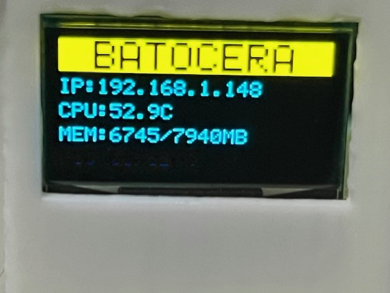
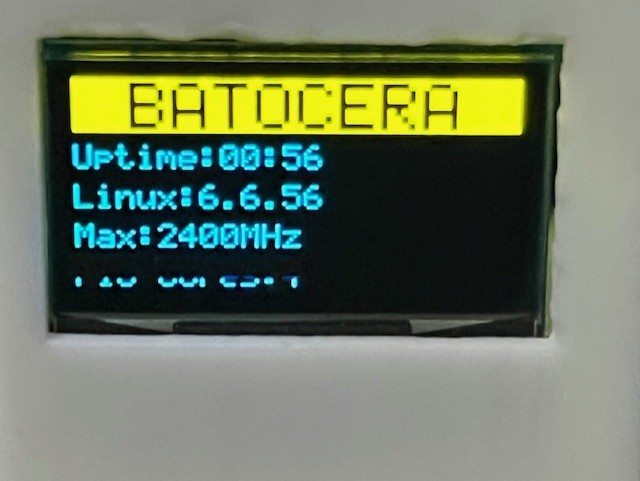
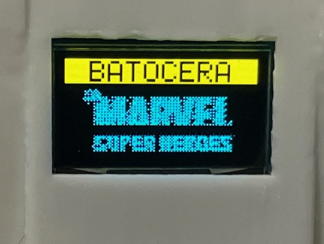
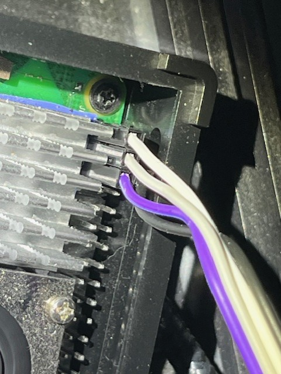
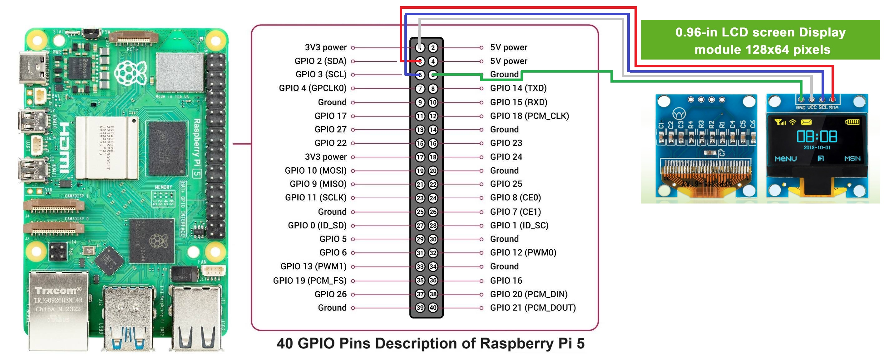
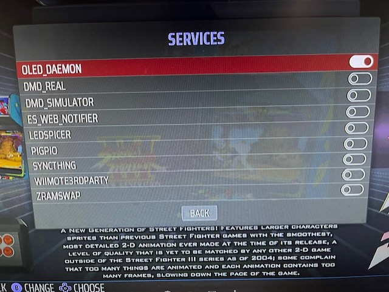

# Batocerai2c2OLED

Batocera OLED marquee daemon for **SSD1306 128x64 I2C displays** on Raspberry Pi.

This project adds a small OLED screen to Batocera systems that shows
system information in the menu and game marquee artwork while playing games.

---

## Features

### Menu Mode
Displayed when no game is running.

- BATOCERA banner in the yellow band (bicolor OLED)
- Rotating status pages (4 lines per page)
- Information shown:
  - IP address
  - CPU temperature
  - Memory usage
  - Raspberry Pi type and core count

### Game Mode
Displayed when a game is launched.

- Shows the game **marquee / wheel / logo** image
- Automatically detected from:
  - `gamelist.xml`
  - `images/` directory
- Supports common artwork naming conventions
- Falls back to text if no image is found
- Cached rendering for performance

---

## Screenshots

### Main Menu Display
Shows system information when no game is running.




### Game Marquee Display
Shows the game marquee artwork while a game is running.



> Place your screenshots in a `screenshots/` folder in the repository.
> Supported formats: JPG or PNG.

---

## Wiring Diagram (SSD1306 I2C)

### Raspberry Pi 5 → SSD1306 128x64

| OLED Pin | Raspberry Pi Pin | Description |
|--------|------------------|-------------|
| GND    | GND              | Ground |
| VCC    | 3.3V             | Power |
| SDA    | GPIO 2 (Pin 3)   | I2C Data |
| SCL    | GPIO 3 (Pin 5)   | I2C Clock |

> ⚠️ **Important**
> - Use **3.3V**, not 5V.
> - Most SSD1306 modules default to I2C address `0x3C`.
> - I2C must be enabled in Batocera.

Example wiring reference:




---

## Tested Hardware

- Batocera ES **v41** (2024-11-28)
- Raspberry Pi 5
- SSD1306 128x64 I2C **bicolor (yellow / blue)**
- Framebuffer device: `/dev/fb1`

---

## Installation

SSH into your Batocera system and run:

```sh
git clone https://github.com/jeborgesm/Batocerai2c2OLED
cd Batocerai2c2OLED
./install.sh
```

---

## Enable the Service (Required)

After installation, the OLED daemon **must be enabled** in Batocera.

1. Open the **Batocera Main Menu**
2. Go to **System Settings**
3. Select **Services**
4. Enable **OLED_DAEMON**
5. Reboot (recommended)

### Batocera Services Menu



---

## Uninstall

```sh
./uninstall.sh
```

If the service was enabled, also disable it in:

**Main Menu → System Settings → Services → OLED_DAEMON → OFF**

---

## How It Works

- Batocera runs `/userdata/system/services/OLED_DAEMON` at boot.
- `oled_state.sh` is called by Batocera when games start or stop.
- Game state is written to:

```
/tmp/oled.state
```

- `oled_daemon.py` reads this state and:
  - Displays system metrics in menu mode
  - Displays game artwork in game mode
- Artwork is converted to 1-bit using `ffmpeg` and written directly to
  `/dev/fb1`.

---

## Artwork Requirements

For best results, scrape artwork for your systems.

Supported sources:
- `<marquee>` or `<image>` entries in `gamelist.xml`
- Files in the system `images/` directory

Supported filename patterns:
- `romname-marquee.png`
- `romname-wheel.png`
- `romname-logo.png`
- `romname.png`

---

## Notes

- Designed specifically for **Batocera Linux**
- Does not rely on RetroPie scripts or patches
- Uses Batocera’s native service system
- Minimal dependencies (Python + ffmpeg)

---

## Credits

Inspired by RetroPie OLED projects,  
implemented natively for Batocera Linux.

---

## License

MIT License

Copyright (c) 2026 Jaime Borges

Permission is hereby granted, free of charge, to any person obtaining a copy
of this software and associated documentation files (the "Software"), to deal
in the Software without restriction, including without limitation the rights
to use, copy, modify, merge, publish, distribute, sublicense, and/or sell
copies of the Software, and to permit persons to whom the Software is
furnished to do so, subject to the following conditions.

THE SOFTWARE IS PROVIDED "AS IS", WITHOUT WARRANTY OF ANY KIND.
